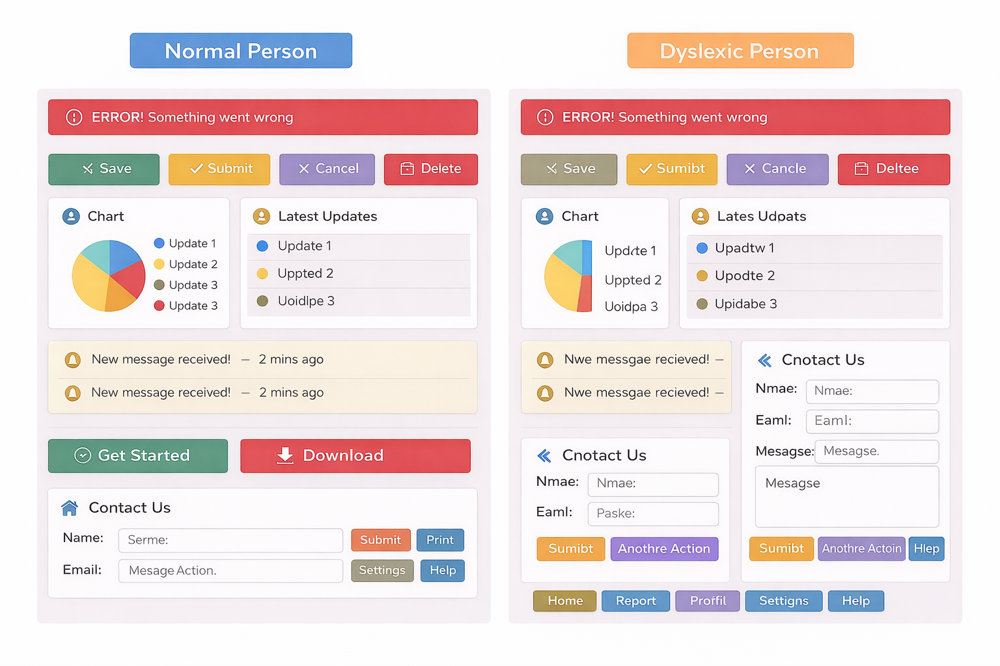

# Accessibilité des interfaces numériques

## Définition

L’**accessibilité des interfaces** consiste à concevoir des interfaces numériques qui peuvent être **perçues, comprises et utilisées par le plus grand nombre**, y compris les personnes ayant des **limitations physiques, sensorielles, cognitives ou situationnelles**.

> Une interface accessible est une interface utilisable par **tout le monde**, sans exclusion.

---

## Types de limitations prises en compte

### 1. Limitations visuelles 👁️
- Cécité totale ou partielle
  
- Basse vision
- Daltonisme
  
  
- Sensibilité à la lumière

---

### 2. Limitations auditives 👂
- Surdité partielle ou totale

---

### 3. Limitations motrices ✋
- Difficulté à utiliser une souris
- Tremblements
- Paralysie partielle
- Utilisation d’aides techniques (clavier, commande vocale)

---

### 4. Limitations cognitives 🧠
- Troubles de l’attention (TDAH)
- Dyslexie
  
- Difficultés de compréhension ou de mémoire
- Stress et surcharge cognitive

---

### 5. Limitations neurologiques ⚡
- Épilepsie photosensible
- Sensibilité aux animations rapides

---

### 6. Limitations situationnelles ⏱️📱
- Environnement bruyant
- Forte luminosité
- Fatigue
- Connexion lente
- Une seule main disponible

---

## WCAG : Web Content Accessibility Guidelines

- Standard international créé par le **W3C** pour rendre les sites web accessibles.  
- Basé sur les 4 principes ci-dessus : **Perceptible, Utilisable, Compréhensible, Robuste**.  
- Trois niveaux de conformité :
  - **A** : minimum requis  
  - **AA** : niveau standard recommandé  
  - **AAA** : niveau optimal, toutes les bonnes pratiques  

> Les sites professionnels et éducatifs doivent viser **au moins le niveau AA**.

---

## Lois sur l’accessibilité

### Canada 🇨🇦
- **Loi canadienne sur l’accessibilité (LACC)** : obligatoire pour institutions fédérales et certaines entreprises  
- **Norme CSA B651** : norme sur l’accessibilité des technologies de l’information  
- WCAG 2.0 niveau AA comme référence principale

---

## Bonnes pratiques à suivre

1. Fournir des **alternatives textuelles** pour images et icônes
  Exemple : ``
Les alternatives textuelles permettent aux lecteurs d’écran de décrire l’image (tester avec un lecteur d'écran).
 
3. Maintenir un **contraste élevé** entre texte et fond (≥ 4.5:1)
   Le contraste permet de distinguer le contenu du fond. Un mauvais contraste rend la lecture difficile (tester avec une vérificateur de contraste).
   
5. Assurer une **navigation complète au clavier** (tester manuellement) 
6. Utiliser un **langage simple** et clair  
7. Fournir un **feedback compréhensible** pour les erreurs  
8. Éviter les **animations rapides ou clignotantes**  
9. Tester avec **simulateurs de daltonisme, lecteurs d’écran et zoom**

