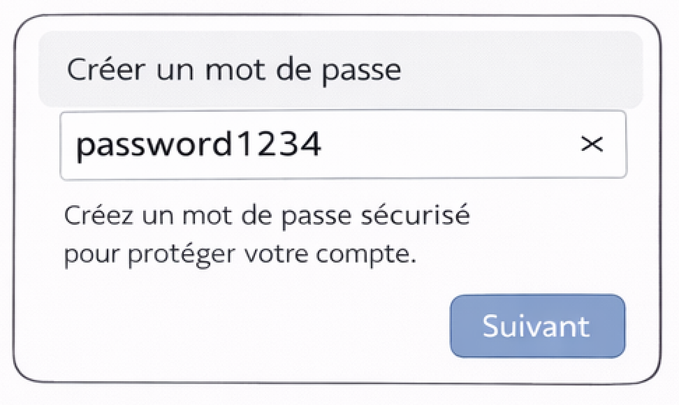

## 🧠 Principe 1

### Exemple

### Question pour l’étudiant
- Que ressentez-vous en regardant cette interface ?

---

### ✅ Définition

**La charge cognitive** correspond à la quantité d’effort mental nécessaire pour comprendre et utiliser une interface.  
Une bonne interface **réduit la charge cognitive** en :
- limitant le nombre d’informations visibles,
- hiérarchisant clairement le contenu,
- évitant les choix inutiles.

---

## 🔔 Principe 2

### Exemple

### Question pour l’étudiant
- Que se passe-t-il après avoir cliqué sur le bouton ?

---

### ✅ Définition

Le **feedback** est la réponse visible ou audible du système après une action de l’utilisateur.  
Il permet de :
- rassurer l’utilisateur,
- confirmer une action,
- éviter la confusion.

---

## ✋ Principe 3

### Exemple

### Question pour l’étudiant
- Quels éléments sont cliquables ?
- Est-ce évident sans explication ?
- Pourquoi l’utilisateur peut hésiter ?

---

### ✅ Définition

L’**affordance** désigne la capacité d’un élément à **suggérer son utilisation**.  
Un bouton doit ressembler à un bouton, un champ de texte à un champ de texte.

---

## 🚧 Principe 4

### Exemple

### Question pour l’étudiant
- L’utilisateur peut-il faire une erreur ?
- L’interface empêche-t-elle les mauvaises actions ?
- Comment pourrait-on guider l’utilisateur ?

---

### ✅ Définition

Les **contraintes** limitent les actions possibles pour éviter les erreurs.  
Une bonne interface **empêche l’erreur plutôt que de la corriger après**.

---

## 🧩 Principe 5

### Exemple

### Question pour l’étudiant
- Quels éléments vont ensemble ?
- Est-ce évident visuellement ?
- Pourquoi la lecture est-elle difficile ?

---

### ✅ Définition

Les **lois de Gestalt** expliquent comment l’humain perçoit les formes et les groupes.  
Elles incluent :
- proximité
- similarité
- continuité
- fermeture
  
---

## 🧩 Principe 6

### Exemple

### Question pour l’étudiant
- Est-ce qu'il est facile de corriger l'erreur de l'utilisateur dans le cas de cette interface ?

---

### ✅ Définition

Les **heuristiques de Nielsen** sont des principes généraux qui permettent d’identifier rapidement les problèmes d’utilisabilité d’une interface.
Elles incluent :
- Visibilité de l’état du système
- Correspondance entre le système et le monde réel
- Contrôle et liberté de l’utilisateur
- Cohérence et standards
- Prévention des erreurs
- Reconnaissance plutôt que mémorisation
- Flexibilité et efficacité d’utilisation
- Design esthétique et minimaliste
- Aider à reconnaître, diagnostiquer et corriger les erreurs
- Aide et documentation

---
## 📏 Espacements

- On utilise presque toujours une grille et un système d’espacement cohérent.

- Règles courantes :

* Utiliser une grille de 8 px (8, 16, 24, 32, 48…)

* L’espace entre des éléments liés < espace entre des groupes différents

* Ne jamais utiliser des espacements “au hasard” (ex : 13px, 19px)

👉 Principe clé : la proximité = relation (loi de Gestalt)

---

## 🧱 Alignement

- Éviter les alignements approximatifs

- Aligner sur une grille verticale et horizontale

- Moins d’alignements = interface plus lisible

---

## 🎨 Règles fondamentales

- 1 couleur principale

- 1–2 couleurs secondaires

- Couleurs neutres (gris, blanc, noir) pour le reste

- Ne jamais transmettre une information uniquement par la couleur

👉 Exemples :

* Rouge ≠ seule indication d’erreur

* Vert ≠ seul indicateur de succès

* Cohérence sémantique :

Rouge → danger / erreur

Vert → succès / validation

Bleu → action / lien (le plus universel)

---

## 🅰️ Règles essentielles

- 1 ou 2 polices maximum

- Taille minimum texte : 14–16 px

- Hauteur de ligne : 1.4 à 1.6

- Hiérarchie claire

- Titres visibles sans lire le texte

👉 Si tout a l’air important → rien ne l’est

---

## 🖱️ Le mythe des “3 clics”

❌ Ce n’est pas une vraie règle

✅ La vraie règle :

L’utilisateur accepte plus de clics si le chemin est clair et logique

Bonnes pratiques

* Action principale accessible en 1 clic

* Éviter les menus trop profonds

* Toujours indiquer “où on est” et “où on va”

---

## 🧠 Loi de Hick

Plus il y a de choix, plus la décision est lente

👉 Solutions :

- Regrouper les options

- Masquer l’avancé (progressive disclosure)

- Prioriser une action principale

---

## 🔘 Boutons

- Taille minimale tactile : 44×44 px

- Un bouton principal par écran

- Jamais de clic “silencieux”
