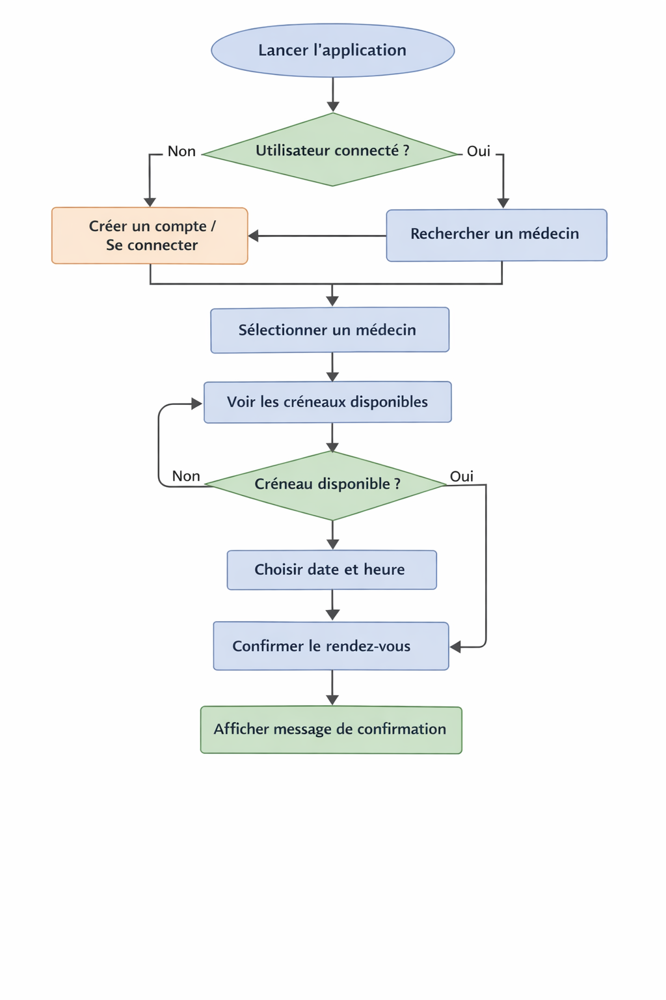

# Workflow de conception d’une interface

Dans cette section, nous allons détailler les étapes pour créer une bonne interface à l’aide d’un exemple concret : une **application de réservation de rendez-vous médicaux**.  

---

## 1. Comprendre le système et le contexte

### Objectif
Avant de concevoir l’interface, il faut comprendre :
- **À quoi sert le système ?**  
  Ex : Permettre aux patients de prendre rendez-vous facilement avec leur médecin.
- **Dans quel contexte est-il utilisé ?**  
  Ex : Application mobile utilisée n'importe où avec une connexion internet.
- **Contraintes techniques**  
  Écran mobile, connexion internet variable, notifications push.

### Outils / méthodes
- **Analyse du système existant**
- **Interviews de stakeholders** (médecins, secrétaires)
- **Étude de marché** (applications similaires)

---

## 2. Identifier les utilisateurs

### Objectif
Savoir **qui utilisera l’application** pour mieux adapter l’interface.

### Exemple
- Patient adulte avec smartphone
- Personnes âgées avec moins d’expérience technique
- Médecins et secrétaires (qui gèrent les rendez-vous)

### Outil : Persona
Un **persona** est une **représentation fictive mais réaliste d’un utilisateur type**.  
Exemple :

| Nom | Contexte | Objectifs | Compétences techniques |
|-----|----------|-----------|----------------------|
| Marie, 68 ans | Retraitée, souhaite prendre un rendez-vous rapide | Réserver un rendez-vous sans se tromper | Utilise smartphone mais peu familière avec apps |

> Les personas permettent de **garder l’utilisateur réel au centre de la conception**.

---

## 3. Définir les objectifs de l’utilisateur

### Objectif
Identifier ce que l’utilisateur veut **réellement accomplir**.

### Exemple
- Trouver un médecin disponible rapidement
- Choisir une date et un créneau
- Recevoir une confirmation
- Modifier ou annuler le rendez-vous facilement

> Ces objectifs guideront **toutes les décisions de design**.

---

## 4. Concevoir le parcours utilisateur (UX)

### Objectif
Définir **les étapes que l’utilisateur suit** pour atteindre son objectif.

### Exemple
1. Lancer l’application
2. Rechercher un médecin
3. Sélectionner un créneau disponible
4. Confirmer le rendez-vous
5. Recevoir une notification de confirmation

### Outils / méthodes
- **User flow (ou diagramme de flux)** : schéma montrant chaque étape et décision
- **Storyboards** : dessins rapides de l’expérience utilisateur
- **Scénarios d’usage** : description narrative de l’expérience d’un utilisateur

> Le user flow aide à **visualiser le parcours et repérer les points de friction**.

---

## 5. Concevoir l’interface (UI)

### Objectif
Décider **à quoi l’interface va ressembler et comment l’utilisateur interagit avec elle**.

### Exemple
- Boutons « Réserver », « Modifier », « Annuler »
- Calendrier avec créneaux visibles
- Menu simple pour naviguer entre les médecins, rendez-vous et profil

### Outils / méthodes
- **Wireframes** : maquettes basse fidélité qui montrent l’emplacement des éléments
  - Créés avec **papier/crayon**, **Figma**, **Balsamiq** ou **Sketch**
  - Permettent de se concentrer sur **la structure sans couleurs ni détails graphiques**
- **Prototypes interactifs** : ajoutent clics ou transitions pour simuler l’expérience
  - Figma ou Adobe XD

> Les wireframes et prototypes permettent de **tester rapidement les idées avant le développement**.

---

## 6. Tester et améliorer

### Objectif
Valider que l’interface est **facile, efficace et agréable**.

### Exemple
- Tester l’application avec 5-10 utilisateurs (patients)
- Observer où ils se trompent ou hésitent
- Recueillir leurs impressions et suggestions

### Outils / méthodes
- **Tests utilisateurs** : observation directe
- **Feedbacks et questionnaires**
- **Itérations rapides** : corriger les problèmes et refaire un test

> Une interface **n’est jamais parfaite du premier coup** : l’amélioration continue est essentielle.

---

## 🔹 Résumé du workflow

1. **Comprendre le système** → analyser le contexte et les contraintes  
2. **Identifier les utilisateurs** → créer des personas  
3. **Définir les objectifs de l’utilisateur** → savoir ce qu’il veut accomplir  
4. **Concevoir le parcours utilisateur (UX)** → user flows, scénarios, storyboards  
5. **Concevoir l’interface (UI)** → wireframes, prototypes, hiérarchie visuelle  
6. **Tester et améliorer** → tests utilisateurs, feedback, itérations  

> Chaque étape se construit sur la précédente, toujours **centrée sur l’utilisateur**.
